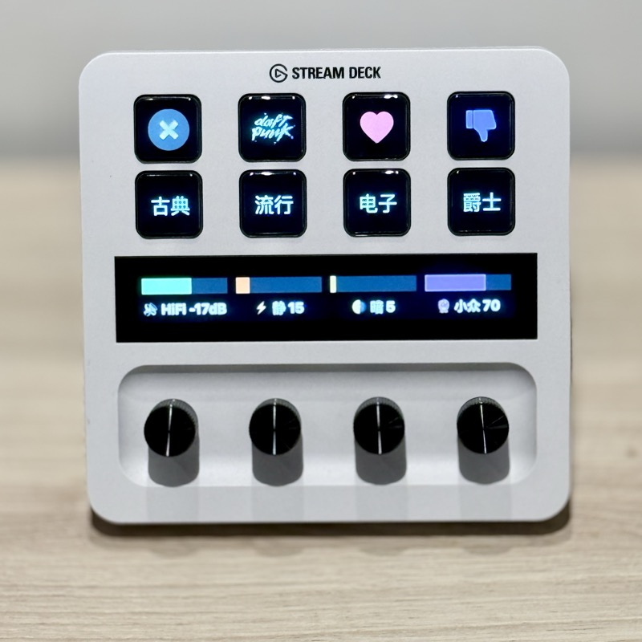

# Vibe Music Console

> Turn an Elgato Stream Deck+ into an AI-powered music curation console for your HiFi system.

**Vibe Console** is an open-source system that combines a physical Stream Deck+ controller with LLM-driven music curation, Apple Music playback, Genelec GLM speaker control, and LG TV automation — all wired together into a seamless one-touch experience.



## What It Does

1. **Turn a dial** → AI generates a personalized playlist based on your energy/mood/discovery settings
2. **Press a button** → Instantly plays from your curated genre library
3. **Twist the volume knob** → Controls Genelec monitors via MIDI
4. **One-button AV switching** → Wakes LG TV via WOL, switches HDMI input, sets speaker group

### Key Features

- **🤖 LLM-Powered Music Curation** — Uses DeepSeek/OpenAI to generate playlists tailored to your taste, mood, and time of day
- **🎛 3-Axis Physical Controls** — Energy, Mood, and Discovery dials on SD+ physically shape what the AI recommends
- **👨‍👩‍👧 Multi-User Profiles** — Each family member has their own 4-genre library with independent preferences
- **🔊 Genelec GLM Integration** — Volume, mute, and speaker group switching via reverse-engineered MIDI protocol
- **📺 LG WebOS TV Control** — Wake-on-LAN + HDMI switching from standby
- **🎵 Apple Music Native** — Songs are verified on iTunes API, added to your library, and played via native AppleScript
- **🌙 Software Screensaver** — Auto-dims SD+ after idle (since SD has no brightness API)
- **🔄 Auto-Refill** — When your genre library runs low, AI quietly restocks it in the background

## Architecture

```
┌─────────────────┐     HTTP/REST      ┌──────────────────┐
│  Stream Deck+   │ ◄────────────────► │  Vibe Backend    │
│  (SD Plugin)    │     localhost:8555  │  (Python)        │
│                 │                     │                  │
│  • 4 Encoders   │                     │  • LLM API       │
│  • 8 Keys       │                     │  • Apple Music   │
│  • Touch Strip  │                     │  • iTunes Search │
└─────────────────┘                     │  • GLM MIDI      │
                                        │  • LG WebOS      │
                                        │  • Play History  │
                                        └──────────────────┘
```

### SD+ Button Layout

| Position | Type | Function |
|----------|------|----------|
| Dial 1 | Encoder | 🔊 Volume (GLM MIDI CC#20) |
| Dial 2 | Encoder | ⚡ Energy axis (0-100) |
| Dial 3 | Encoder | 🌗 Mood axis (0-100) |
| Dial 4 | Encoder | 🔮 Discovery axis (0-100) |
| Keys | Buttons | Profile switch, Genre play, Love, Skip, Generate, Home, TV switch |

## Requirements

### Hardware
- **Elgato Stream Deck+** (model with dials)
- **Mac** running macOS (Apple Music + AppleScript required)
- **Genelec SAM monitors** with GLM software (optional — for speaker control)
- **LG WebOS TV** (optional — for TV automation)

### Software
- **Node.js 20+** (for SD plugin)
- **Python 3.9+** (for backend)
- **Apple Music** subscription (songs are verified via iTunes API)
- **Stream Deck** app v6.7+

### Python Dependencies
```bash
pip install mido python-rtmidi bscpylgtv
```

## Quick Start

### 1. Clone & Configure

```bash
git clone https://github.com/sisley-core/vibe-music-console.git
cd vibe-music-console
```

Create your config file:
```bash
cp backend/.env.example backend/.env
# Edit backend/.env with your API key and network settings
```

### 2. Start the Backend

```bash
cd backend
python3 vibe_server.py
# Server starts at http://localhost:8555
```

### 3. Build & Install the SD Plugin

```bash
cd plugin
npm install
npm run build
```

Then symlink the plugin directory:
```bash
ln -s "$(pwd)/com.vibe.console.sdPlugin" \
  ~/Library/Application\ Support/com.elgato.StreamDeck/Plugins/com.vibe.console.sdPlugin
```

Restart the Stream Deck app.

### 4. Cold Start (First Time)

Build initial genre libraries for each profile:
```bash
curl http://localhost:8555/vibe/init/alice
curl http://localhost:8555/vibe/init/bob
curl http://localhost:8555/vibe/init/grandma
```

This uses AI to generate seed songs, verify them on Apple Music, and add them to your library. Takes a few minutes per profile.

## Configuration

### Profiles

Edit `PROFILES` in `backend/vibe_server.py` to define your household members. Each profile has:

- **preferences** — Natural language description of taste (fed to LLM)
- **genres** — 4 genre slots, each with an AI prompt constraint and Apple Music playlist name
- **neighbors** — Which genres can blend into each other during "journey mode"
- **time_weights** — Time-of-day genre preferences (morning/afternoon/evening/night)

### Environment Variables

See `backend/.env.example` for all available settings:

| Variable | Description | Default |
|----------|-------------|---------|
| `LLM_API_KEY` | API key for DeepSeek/OpenAI | (required) |
| `LLM_BASE_URL` | LLM API endpoint | `https://api.deepseek.com/v1` |
| `LLM_MODEL` | Model name | `deepseek-chat` |
| `LG_TV_IP` | LG TV IP address | `192.168.1.100` |
| `LG_TV_MAC` | LG TV MAC address (for WOL) | `AA:BB:CC:DD:EE:FF` |
| `MEMORY_DIR` | Directory for library metadata | `~/vibe-console/memory` |

### Genelec GLM Setup

1. In GLM → Preferences → Enable MIDI Control
2. Create a virtual MIDI port (macOS: Audio MIDI Setup → IAC Driver)
3. Map CC#20 to Master Volume, CC#29/31 to Group switching

### LG TV Setup

1. Enable **Quick Start+** in TV settings
2. Enable **Mobile TV On** (Settings → General → Mobile TV On)
3. Pair with `bscpylgtv` first: `python3 -c "from bscpylgtv import WebOsClient; ..."`

## API Reference

### Music Control
| Endpoint | Description |
|----------|-------------|
| `GET /vibe/profile/{name}` | Start journey mode for a profile |
| `GET /vibe/genre/{name}` | Play from a specific genre |
| `GET /vibe/generate` | AI-generate playlist from current 3-axis settings |
| `GET /vibe/skip` | Skip current song (records skip in metadata) |
| `GET /vibe/love` | Love current song (boosts in future picks) |
| `GET /vibe/exit` | Stop playback |
| `GET /vibe/dial?axis=energy&delta=5` | Adjust axis value |
| `GET /vibe/state` | Get full system state |

### Speaker & TV
| Endpoint | Description |
|----------|-------------|
| `GET /glm/vol_up` | Volume +1 dB |
| `GET /glm/vol_dn` | Volume -1 dB |
| `GET /glm/mute` | Toggle mute |
| `GET /glm/status` | Get volume/group/mute state |
| `GET /tv/mac` | Switch to Mac HDMI + HiFi mode |
| `GET /tv/appletv` | Switch to AppleTV HDMI + Movie mode |

## How It Works

### AI Curation Pipeline

1. User adjusts Energy/Mood/Discovery dials and presses the encoder
2. Backend builds a detailed prompt with axis values + user preferences + genre constraints
3. LLM returns 10 song recommendations as JSON
4. Each song is verified against the iTunes Search API
5. Verified songs are added to Apple Music library via AppleScript UI automation
6. First song plays immediately; remaining songs continue adding in background
7. Metadata (play count, loved, skip count) is tracked for future recommendations

### Journey Mode

When you press a profile button, the system:
1. Picks the best starting genre based on time of day + listen history
2. Plays songs from that genre
3. After ~3 songs, has a 50% chance to "drift" to a neighboring genre
4. Never drifts back to the previous genre (always moves forward)

### Software Screensaver

Since SD+ has no brightness API, the plugin implements a software screensaver:
- After 15 minutes idle, all keys switch to black icons (`setState(1)`)
- All dials disable their layout elements (`setFeedback({enabled: false})`)
- Any interaction (key press, dial turn) restores the display instantly

## Project Structure

```
vibe-music-console/
├── backend/
│   ├── vibe_server.py      # Python backend (HTTP server, AI, Apple Music, GLM, TV)
│   └── .env.example         # Configuration template
├── plugin/
│   ├── src/
│   │   ├── plugin.ts        # Main plugin entry, polling, screensaver
│   │   ├── api.ts           # Backend API helper
│   │   ├── activity.ts      # Idle tracking
│   │   └── actions/
│   │       ├── vibe-button.ts      # Key button handler
│   │       ├── vibe-dial-shared.ts # Shared dial logic (refresh, rotate, press)
│   │       ├── vibe-hub.ts         # Cross-dial refresh registry
│   │       ├── volume-dial.ts      # Volume encoder
│   │       ├── energy-dial.ts      # Energy axis encoder
│   │       ├── mood-dial.ts        # Mood axis encoder
│   │       └── discovery-dial.ts   # Discovery axis encoder
│   ├── com.vibe.console.sdPlugin/
│   │   ├── manifest.json    # SD plugin manifest
│   │   ├── layouts/         # Dial LCD layout definitions
│   │   ├── profiles/        # SD+ profile configurations
│   │   └── static/imgs/     # Icons and assets
│   ├── package.json
│   ├── rollup.config.mjs
│   └── tsconfig.json
├── docs/                    # Documentation and images
├── LICENSE
└── README.md
```

## Acknowledgments

- [Elgato Stream Deck SDK](https://docs.elgato.com/) for the plugin framework
- [bscpylgtv](https://github.com/chros73/bscpylgtv) for LG WebOS control
- [DeepSeek](https://deepseek.com/) for affordable LLM API
- The Home Assistant, audiophile, and Stream Deck communities for inspiration

## License

[MIT](LICENSE) — Use it, fork it, make it yours.
